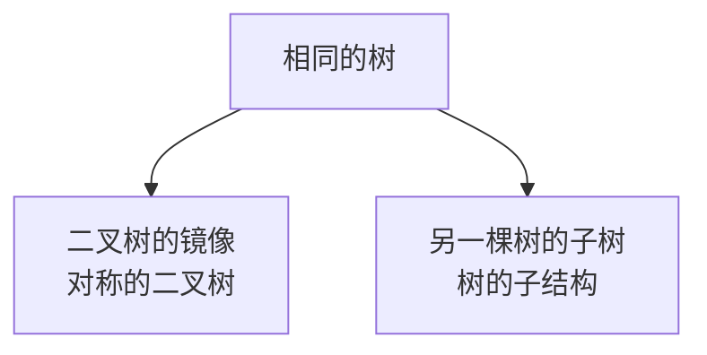

### 使用方法：
1. 本题单分为两大部分：
   - 树的遍历&树的生成：套路性和关联性极强，放心食用
   - 其他细节小题：都是1~3个题目组成的小单元，小单元内重点注意：区分不同题目之间的区别与联系，思路代码要分辨清楚。
2. 按照下面列出的顺序，根据题号在acwing找到对应的讲解视频，视频+笔记 学习 思路+代码。可以不用先看题目自己做一遍，都是经典思路，直接学习高效的代码就好。
3. 可以用文件夹中的代码做补充学习
4. 后缀为md+包含大量注释的文件 都是良心总结，值得一读
5. 售后服务50年，24h热线聊天框欢迎来聊！

### 树的遍历&树的生成
**知识点小结：**
1. D为中间节点，L为左子树，R为又子树：什么顺序遍历，根D就在什么位置，剩下两个位置先L后R
2. 二叉搜索树BST的中序遍历结果是**有序**的
3. 任意二叉树，叶子节点数=$n_0$，度为2的节点数=$n_2$，则$n_0 = n_2 + 1$ 
   空节点比非空节点数量多1
   - **结点的度**：结点拥有的子树数量称为结点的度[graph中的出度概念
   - 二叉树中所有结点的度都<=2

**题单：** 本文件夹中的遍历题code只有递归做法，迭代做法**未完成**
144前序遍历（先根遍历） DLR 递归做法/迭代做法
94中序遍历（中根遍历） LDR 递归做法/迭代做法
145后序遍历（后根遍历） LRD 递归做法/迭代做法[迭代做法需要先用类似前序遍历得到DRL，再反转结果得到LRD]
102层序遍历
107层序遍历的扩展

653两数之和IV-输入BST

105前序遍历+中序遍历恢复二叉树
106中序遍历+后序遍历恢复二叉树

331验证二叉树的前序序列化
验证二叉搜索树的后序遍历
从先序遍历还原二叉树
二叉树的下一个节点（后继）

### 其他细节题
112路径总和
113路径总和II

235二叉搜索树的最公共祖先问题1
236任意二叉树的最近公共祖先1

104二叉树的最大深度1
543二叉树的直径1
124二叉树的最大路径和

100相同的树1
二叉树的镜像1
101对称的二叉树1
另一棵树的子树1
树的子结构1

### 2022.10.7刷题记录
124
113
331
617
二叉树的后继:这里要背过
