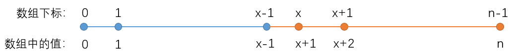

### 0到n-1中缺失的数字
- 思路：(二分) O(logn)
这道题目给定的是递增数组，假设数组中第一个缺失的数是 xx，那么数组中的数如下所示；

从中可以看出，数组左边蓝色部分都满足`nums[i] == i`，数组右边橙色部分都不满足`nums[i] == i`，因此我们可以二分出分界点 `x` 的值。
另外要注意特殊情况：当所有数都满足`nums[i] == i`时，表示缺失的是 `n`。

- 时间复杂度分析
二分中的迭代只会执行 O(logn)O(logn) 次，因此时间复杂度是 O(logn)O(logn)。

- C++ 代码
```c++
class Solution {
public:
    int getMissingNumber(vector<int>& nums) {
        if (nums.empty()) return 0;

        int l = 0, r = nums.size() - 1;
        while (l < r)
        {
            int mid = l + r >> 1;
            if (nums[mid] != mid) r = mid;
            else l = mid + 1;
        }

        if (nums[r] == r) r ++ ;
        return r;
    }
};
```